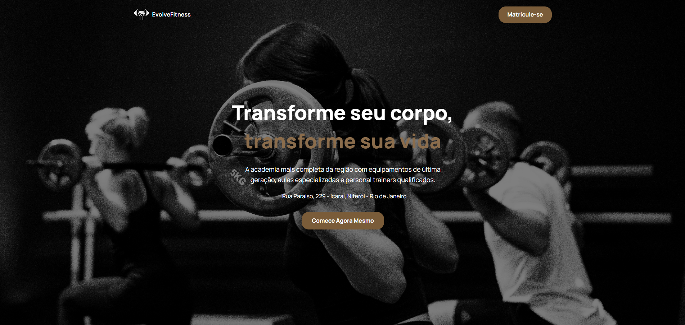
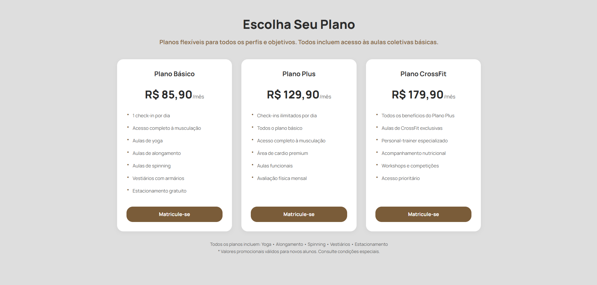
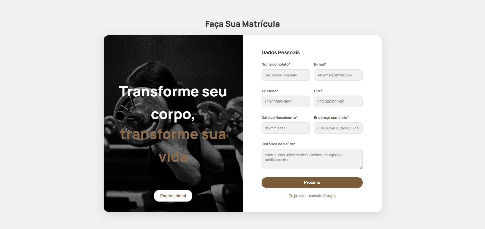

# EvolveFitness

## Visão Geral do Projeto

Este projeto é a implementação em código de um protótipo de site para uma academia fictícia, a EvolveFitness.

O design original foi criado como um trabalho acadêmico para a disciplina de INTERFACE H M E ARQUITETURA DA INFORMAÇÃO. A prototipação de alta fidelidade foi realizada inteiramente no Figma.
Após a conclusão do design, decidi transformar o protótipo estático em um site funcional e interativo. O objetivo principal foi aprender o processo de desenvolvimento front-end, desde a concepção visual até o código. Para acelerar o aprendizado e a codificação, utilizei o auxílio de inteligência artificial como uma ferramenta, me ajudando na realização do projeto.

Você pode visualizar o protótipo original de alta fidelidade que serviu como base para este projeto no link abaixo:
https://www.figma.com/proto/bmEpRkuPUDsqLMIIey3A9x/Prototipa%C3%A7%C3%A3o?node-id=1-3&p=f&t=TqBkyAG7HrvmaXvH-0&scaling=min-zoom&content-scaling=fixed&page-id=0%3A1&starting-point-node-id=1%3A3

---

## Funcionalidades

* **Página Inicial:** Uma landing page completa com todas as seções de marketing da academia.
* **Página de Matrícula/Login:** Um layout de duas colunas (imagem e formulário) que serve tanto para o cadastro de novos alunos quanto para o login de membros existentes.
* **Aba de planos:** Todos os planos da academia com botões que levam diretamente para a página de matrícula.

---

## Visual do Projeto

A interface foi projetada para ser moderna, motivadora e profissional, transmitindo uma sensação de energia e confiança.

---

## Tecnologias Utilizadas

* **HTML5:** Utilizado para a estrutura semântica de todo o conteúdo das páginas.
* **CSS3:** Empregado para estilização, layout e responsividade do site.
* **JavaScript:** Utilizado para a funcionalidade de troca de abas na página de login/matrícula.
* **Figma:** Ferramenta de design e prototipação onde o projeto foi concebido.

---
